# Spring Boot Kafka Workshop - Architecture Documentation

## Overview

This project demonstrates Event-Driven Architecture patterns using Spring Boot and Apache Kafka. It implements a product ordering system with both synchronous (REST) and asynchronous (Kafka) communication patterns.

## System Architecture

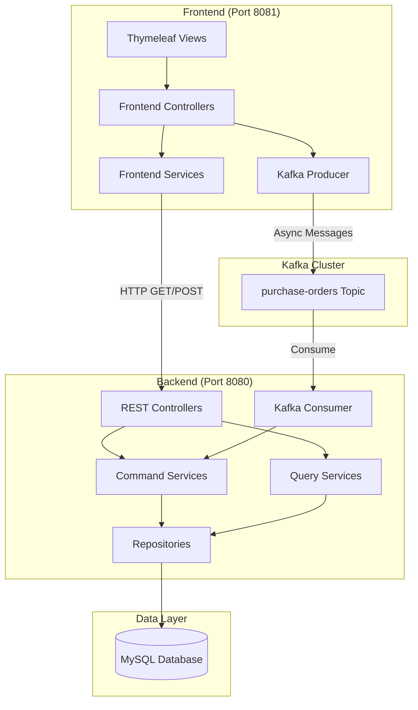

## Communication Patterns

### 1. Synchronous Communication (HTTP REST)

Used for operations requiring immediate response:

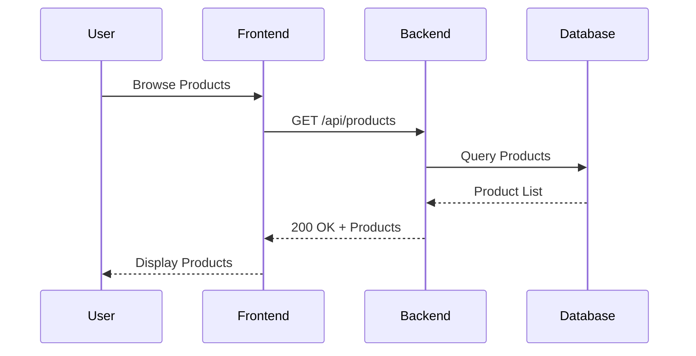

**Use Cases:**
- Product listing (GET /api/products)
- Product details (GET /api/products/{id})
- Order listing (GET /api/orders)
- Order details (GET /api/orders/{id})

### 2. Asynchronous Communication (Kafka)

Used for operations that can be processed independently:

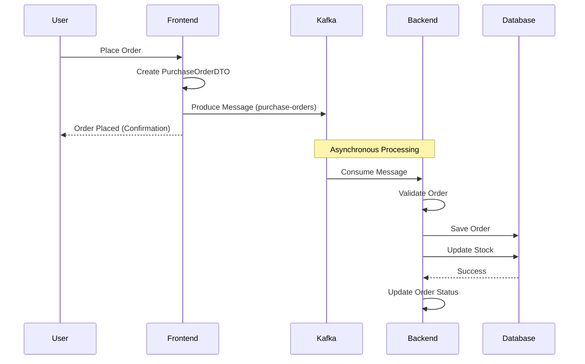

**Use Cases:**
- Purchase order creation
- High-throughput operations
- Decoupled processing
- Multiple consumer support (future)

## CQRS Pattern Implementation

The backend implements Command Query Responsibility Segregation at the service layer:

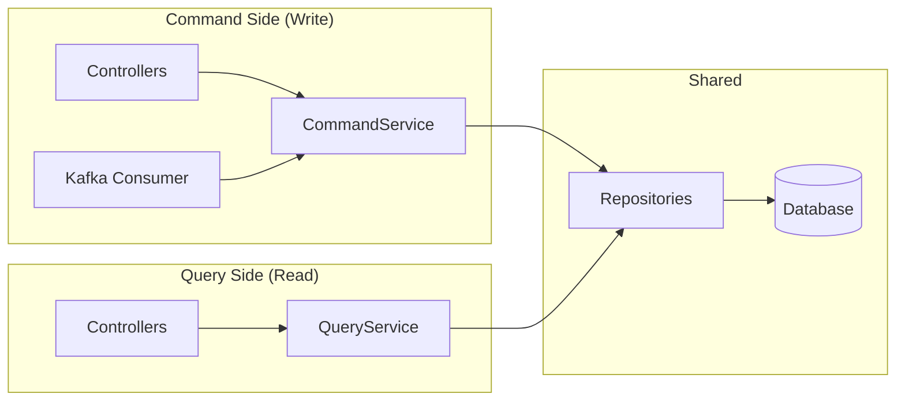

### Command Services (Write Operations)
- **ProductCommandService**:
  - `createProduct()` - Create new product with UUID
  - `updateProduct()` - Update existing product
  - `decrementStock()` - Reduce product inventory

- **OrderCommandService**:
  - `createOrder()` - Process purchase order from Kafka
  - `updateOrderStatus()` - Change order state
  - Validates product availability
  - Manages stock decrements

### Query Services (Read Operations)
- **ProductQueryService**:
  - `getAllProducts()` - List all products
  - `getProductById()` - Find by ID
  - `getProductsByCategory()` - Filter by category

- **OrderQueryService**:
  - `getAllOrders()` - List all orders
  - `getOrderById()` - Get order with items
  - `getOrdersByCustomerId()` - Filter by customer
  - `getOrdersByStatus()` - Filter by status

## Data Flow

### Product Management Flow (Synchronous)

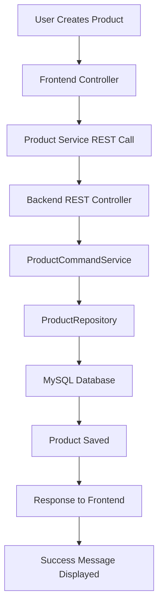

### Purchase Order Flow (Asynchronous)

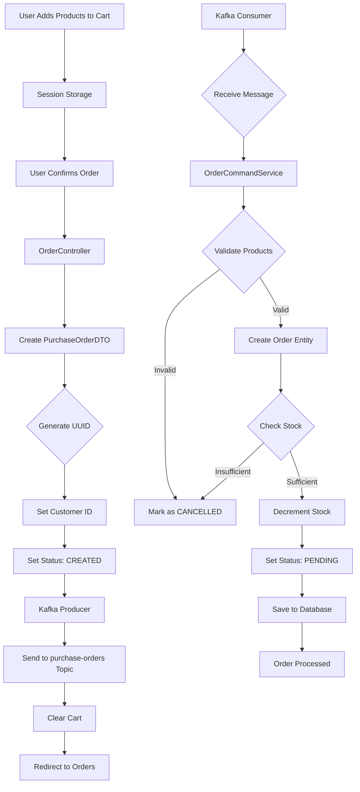

## Domain Model

### Entity Relationships

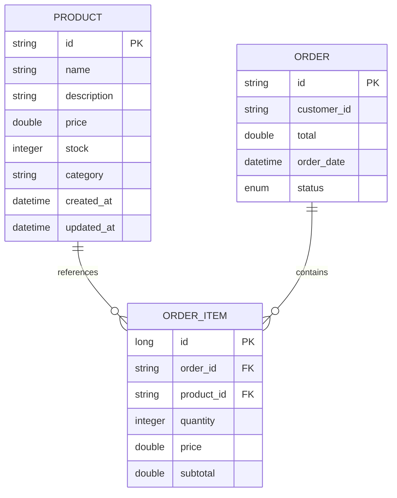

### DTOs and Data Transfer

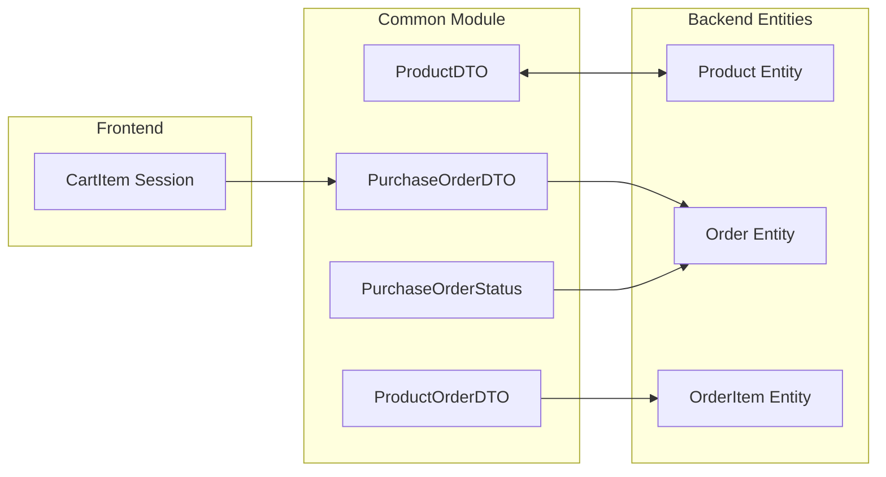

## Technology Stack

### Backend
- **Spring Boot 4.0.6** - Application framework
- **Spring Data JPA** - Data access layer
- **Spring Kafka** - Kafka integration
- **MySQL 8.x** - Relational database
- **Lombok** - Boilerplate reduction
- **Jakarta EE** - Enterprise specifications

### Frontend
- **Spring Boot 4.0.6** - Application framework
- **Thymeleaf** - Template engine
- **Tailwind CSS** - Utility-first CSS
- **Spring Kafka** - Kafka producer
- **RestTemplate** - HTTP client

### Infrastructure
- **Apache Kafka** - Message broker
- **Zookeeper** - Kafka coordination
- **Docker Compose** - Container orchestration
- **Maven** - Build tool
- **Java 25** - Programming language

## Serialization Strategy

### Phase 1: JSON (Current)

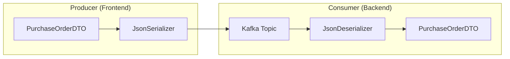

**Advantages:**
- Simple configuration
- Human-readable messages
- Easy debugging
- No schema registry needed

**Limitations:**
- No schema enforcement
- Larger message size
- No versioning support
- No backward/forward compatibility

### Phase 2: Avro (Future)

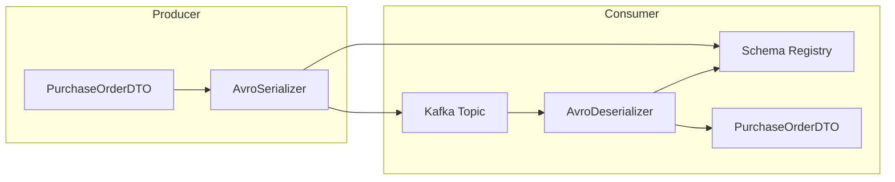

**Advantages:**
- Schema evolution support
- Compact binary format
- Backward/forward compatibility
- Schema validation
- Better performance

## Deployment Architecture

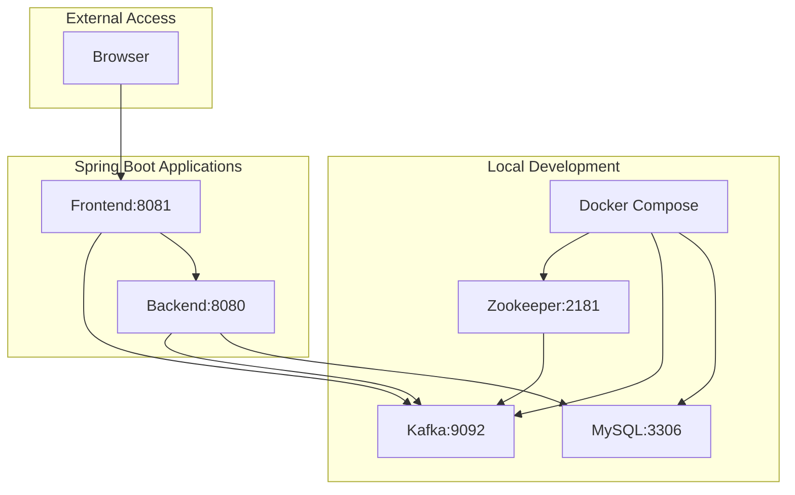

### Port Configuration
- **Frontend**: 8081 (Web UI)
- **Backend**: 8080 (REST API)
- **Kafka**: 9092
- **Zookeeper**: 2181
- **MySQL**: 3306

## Security Considerations

### Current Implementation
- **No Authentication**: Hardcoded customer ID ("CUSTOMER-001")
- **CORS Enabled**: Frontend can access backend API
- **Simplified for Workshop**: Focus on architecture patterns

### Production Recommendations
- Implement Spring Security with JWT
- Add API Gateway (Spring Cloud Gateway)
- Use OAuth2/OIDC for authentication
- Implement rate limiting
- Add SSL/TLS encryption
- Secure Kafka with SASL/SSL
- Implement audit logging

## Performance Considerations

### Optimizations Implemented
- **Connection Pooling**: HikariCP for database
- **Lazy Loading**: JPA entities use FetchType.LAZY
- **Session Management**: Lightweight cart storage
- **Index Strategy**: Primary keys on all tables

### Future Enhancements
- **Caching**: Add Spring Cache for products
- **Kafka Batch Processing**: Tune consumer batch size
- **Database Indexing**: Add indexes on frequently queried columns
- **CDN**: Offload static assets
- **Read Replicas**: Separate read/write databases

## Monitoring and Observability

### Recommended Tools
- **Metrics**: Spring Actuator + Prometheus
- **Logging**: SLF4J + Logback
- **Tracing**: Spring Cloud Sleuth + Zipkin
- **Kafka**: Kafka Manager / Confluent Control Center

### Key Metrics to Monitor
- Kafka consumer lag
- Message processing time
- Database query performance
- HTTP response times
- Error rates

## Testing Strategy

### Unit Tests (Spock Framework)
- Service layer logic
- Business rule validation
- DTO mapping
- Mock external dependencies

### Integration Tests
- Kafka producer/consumer with @EmbeddedKafka
- Repository tests with H2 or Testcontainers
- REST API tests with MockMvc

### End-to-End Tests
- Full user flows
- Cross-service integration
- Performance testing

## Future Enhancements

### Phase 2 Features
1. **Schema Registry**: Avro serialization
2. **Kafka Streams**: Real-time processing
3. **Event Store**: Full event sourcing
4. **Separate Read/Write DBs**: Complete CQRS
5. **Apache Flink**: Complex event processing
6. **Late Data Handling**: Windowing and watermarks

### Additional Capabilities
- Multiple consumer groups
- Dead letter queues
- Saga pattern for distributed transactions
- API versioning
- GraphQL endpoint
